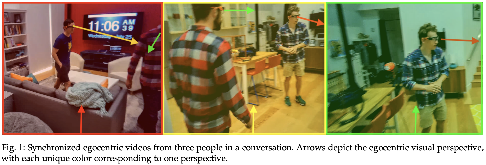
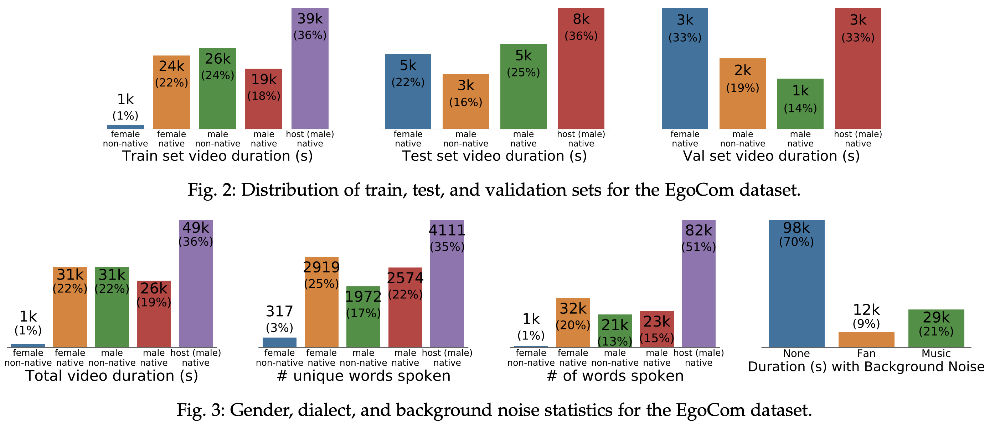
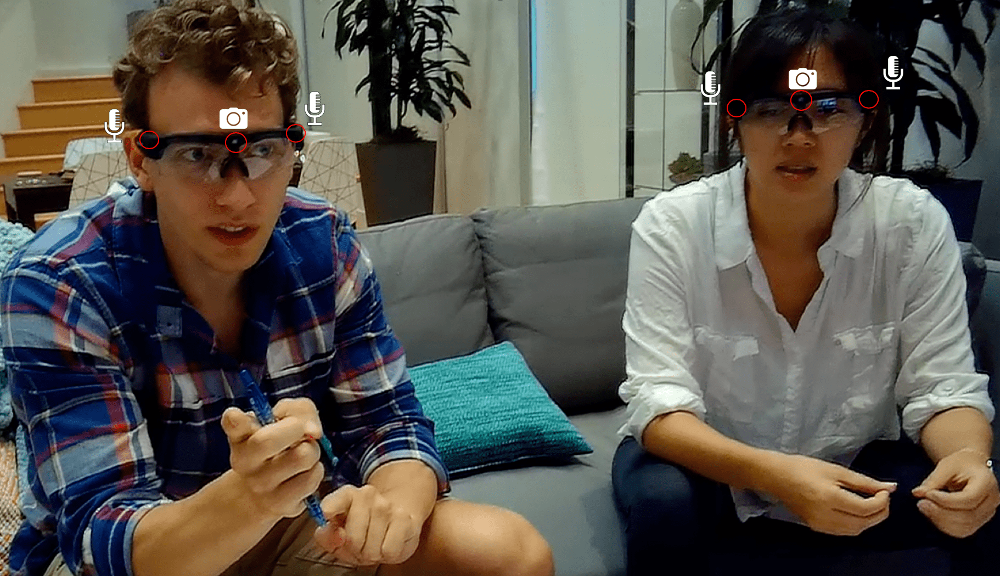

# EgoCom: A Multi-person Multi-modal Egocentric Communications Dataset

Egocentric Communications (EgoCom) is a first-of-its-kind natural conversations dataset containing multi-modal human communication data captured simultaneously from the participants' egocentric perspectives. The EgoCom dataset includes 38.5 hours of conversations comprised of synchronized embodied stereo audio and egocentric video along with 240,000 ground-truth, time-stamped word-level transcriptions and speaker labels from 34 diverse speakers.

This is the release of the EgoCom Dataset associated with the [T-PAMI paper](https://ieeexplore.ieee.org/document/9200754) entitled "EgoCom: A Multi-person Multi-modal Egocentric Communications Dataset". **For example use cases of the EgoCom dataset**, please see the turn-taking prediction and global transcription applications in the paper.**

This repo provides:
1. The EgoCom [Dataset](https://github.com/facebookresearch/EgoCom-Dataset/tree/main/egocom_dataset)
 - To download the EgoCom Dataset, go [[HERE](#download-the-egocom-dataset)]
 - Details about the EgoCom dataset are [[HERE](#egocom-dataset-contents)]
2. The [`egocom`](#egocom-datasetegocom-package----code-details) Python package
 - package for working with multi-perspective egocentric communication data
 - audio functionality, transcription, alignment, etc. Details [[HERE](#egocom-datasetegocom-package----code-details)]
3. A [work log](#work-log-for-research-transparency-and-reproducibility) for the EgoCom paper
 - for transparency, reproducibility, and a snapshot of the creation of the EgoCom dataset.








## Directory explanation of every file in this repository

Contents of importance are in bold.

│── [egocom](https://github.com/facebookresearch/EgoCom-Dataset/tree/main/egocom)  |>  (*Core package used to create the EgoCom Dataset, transcribe, and align audio/videos*)  
│   │── audio.py  |>  (*Audio (.wav) utilty functions*)  
│   │── multi_array_alignment.py  |>  (*Automatic alignment (sychronization) of audio from diff perspectives*)  
│   │── transcription.py  |>  (*Global transcription using transcripts from multiple perspectives*)  
│   '── word_error_rate_analysis.py  |>  (*Analyze accuracy of transcription*)  
│── **[egocom_dataset](https://github.com/facebookresearch/EgoCom-Dataset/tree/main/egocom_dataset)**  |>  (**Data files for the EgoCom Dataset**)  
│   │── download_egocom.sh  |>  (*Download the EgoCom Dataset using this script*)  
│   │── ground_truth_transcriptions.csv  |>  (*Human-created transcriptions for EgoCom Dataset*)  
│   │── speaker_labels  |>  (*(noisy) speaker labels, for every 1 second, for every video in EgoCom dataset*)  
│   │   │── raw_audio_speaker_labels.json  |>  (***Labels** used in turn-taking experiments in EgoCom paper*)  
│   │   '── rev_ground_truth_speaker_labels.json  |>  (*Speaker **labels** used in global transcription*)  
│   '── video_info.csv  |>  (*Important meta-data for each video in EgoCom*)  
│── [paper_experiments_work_log](https://github.com/facebookresearch/EgoCom-Dataset/tree/main/paper_experiments_work_log)  |>  (*Jupyter notebooks of the experiments and analysis for EgoCom paper*)  
│   │── [egocom_dataset_creation](https://github.com/facebookresearch/EgoCom-Dataset/tree/main/paper_experiments_work_log/egocom_dataset_creation)  |>  (*Tasks involved in creating the EgoCom dataset*)  
│   │   │── alignment_example.ipynb  |>  (*Example of automatic alignment of EgoCom videos*)  
│   │   │── auto_align_egocom_dataset.ipynb  |>  (*Automatically align videos within the same conversation*)  
│   │   │── create_train_test_val_sets.ipynb  |>  (*Split EgoCom into train, test, val sets*)  
│   │   │── generate_raw_audio_dataset.ipynb  |>  (*Extract audio wav files from MP4 EgoCom video files*)  
│   │   '── manual_trimming_and_aligning_start_time  |>  (*Sychronize videos within a conversation*)  
│   │       │── manually_align_start.ipynb  |>  (*Trim videos in EgoCom to start with speech*)  
│   │       │── shrink_video.ipynb  |>  (*Create 720p, 420p, and 240p variants of Egocom*)  
│   │       │── trim_to_same_length.ipynb  |>  (*Make aligned, sychronized videos the same length*)  
│   │       '── verify_video_alignment.ipynb  |>  (*Check videos within a conversation are sychronized*)  
│   │── **[global_transcription](https://github.com/facebookresearch/EgoCom-Dataset/tree/main/paper_experiments_work_log/global_transcription)**  |>  (**Application of EgoCom Dataset: 3-person conversation transcription**)  
│   │   │── auto_global_transcription_methods.ipynb  |>  (*Global transcription experiments*)  
│   │   │── computing_wer_accuracy  
│   │   │   '── compute_wer.ipynb  |>  (*Analyze results of global trancription*)  
│   │   │── create_ground_truth_transcriptions_from_json.ipynb  |>  (*How max mag transcription .csv is made*)  
│   │   │── create_ground_truth_transcriptions_from_rev.ipynb  |>  (*SHow human transcription .csv is made*)  
│   │   '── google_speech2text_transcription.ipynb  |>  (*Use Google Speech API to transcribe each video*)  
│   │── PAPER_FIGURE_stats.ipynb  |>  (*Creates figures in EgoCom paper*)  
│   │── speaker_recognition_demo.ipynb  |>  (*Visualize speaker recognize as a graph*)  
│   │── speaker_recognition.ipynb  |>  (*Example of computng speaker recognition accuracy*)  
│   │── spectrogram_from_audio.ipynb  |>  (*Example plotting spectrogram of an audio signal*)  
│   '── **[turntaking](https://github.com/facebookresearch/EgoCom-Dataset/tree/main/paper_experiments_work_log/turntaking)**  |>  (**Application of EgoCom Dataset: Predicting turn-taking in conversations**)  
│       │── ablation_study  |>  (*Code used for ablation studies in the EgoCom paper*)  
│       │── analysis_figures_for_paper  |>  (*Creates turn-taking figures in EgoCom paper*)  
│       │   │── analyze_nn_param_optimization.ipynb  |>  (*Finds the neural net hyper-params used*)  
│       │   │── analyze_nn_training_logs.ipynb  |>  (*Create turn-taking tables in EgoCom paper*)  
│       │   '── make_figure_task2_vs_task3.ipynb  |>  (*Make figure in EgoCom paper*)  
│       │── **[core_scripts_to_reproduce_experiments](https://github.com/facebookresearch/EgoCom-Dataset/tree/main/paper_experiments_work_log/turntaking/core_scripts_to_reproduce_experiments)**  
│       │   │── nn_preprocess_data_for_training.py  |>  (*Pre-compute hdf5 train input per history/future*)  
│       │   │── nn_turntaking_all_experiments.py  |>  (*Script used to run all turn-taking experiments*)  
│       │   '── turntaking_script_examples.bash  |>  (*Examples using nn_turntaking_all_experiments.py*)  
│       │── human_predictions  |>  (*human turn-taking prediction study in EgoCom paper*)  
│       │   │── analyze_human_predictions.ipynb  |>  (*analysis of human turn-taking results*)  
│       │   '── test_set  |>  (*csvs with human turn-taking prediction results*)  
│       │── nn_training_logs  |>  (*neural net training logs from EgoCom turn-taking experiments*)  
│       '── prepare_features  |>  (*Scripts related to generation of pre-trained features*)  
│           │── creating_word_vectors.ipynb  |>  (*Creates text embeddings from transcriptions*)  
│           '── prepare_features.ipynb  |>  (*Concats audio, video, text features*)  


## Citing EgoCom
If you use this package or the EgoCom Dataset in your work, please cite:

    @ARTICLE{9200754,
      author={Curtis G. {Northcutt} and Shengxin {Zha} and Steven {Lovegrove} and Richard {Newcombe}},
      journal={IEEE Transactions on Pattern Analysis and Machine Intelligence}, 
      title={EgoCom: A Multi-person Multi-modal Egocentric Communications Dataset}, 
      year={2020},
      volume={},
      number={},
      pages={1-12},
      doi={10.1109/TPAMI.2020.3025105}}


## Download the EgoCom Dataset
Make sure `pigz` and `wget` are installed:
```
# on Mac OS
brew install wget pigz
# on Ubuntu
sudo apt-get install pigz
```
To download and decompress the EgoCom dataset use the [`egocom_dataset/download_egocom.sh`](https://github.com/facebookresearch/EgoCom-Dataset/blob/main/egocom_dataset/download_egocom.sh) script:
```
./download_egocom.sh DATASET /path/to/egocom/
```
where DATASET is one of egocom1080p_uncompressed, egocom720p, egocom480p, egocom240p, egocom_pretrained_features, egocom_audio_only 

Example usage:
```
./download_egocom.sh egocom720p .
```

This release contains **five variations of the EgoCom dataset** -- the only difference is the resolution of the videos to support varying download speed and storage capabilities:
* **egocom1080p_uncompressed**  *(total size: **267 GB**)*
   - Uncompressed raw 1080p (1920x1080 MP4 videos
* **egocom720p** *(total size: **86 GB**)*
    -  Compressed 720p (1280x720) MP4 videos
* **egocom480p**  *(total size: **28 GB**)*
    -   Compressed 480p (640x480) MP4 videos
* **egocom240p**  *(total size: **9.5 GB**)*
    -   Compressed 240p (352x240) MP4 videos
* **egocom_audio_only**  *(total size: **17 GB**)*
    -   Original raw unnormalized, 16-bit, 44.1 kHz, steroeo WAV audio
    -   Useful if you need audio only or if your spatial AI / conversational AI task needs the original magnitude of each audio signal

We also release **the dataset of pre-trained embedding features** used in the [EgoCom Paper](https://ieeexplore.ieee.org/document/9200754):
* **egocom_pretrained_features**  *(total size: **47 GB**)*
    - For every 1 second of each video in EgoCom, we provide text, video, and audio pre-trained feature embeddings.
    - These feature embeddings can be used to reproduce the results in the [EgoCom Paper](https://ieeexplore.ieee.org/document/9200754). See Section 4.2 for details on how they are computed.

The EgoCom Dataset Release is available here: https://github.com/facebookresearch/EgoCom-Dataset/releases/tag/v1.0


## EgoCom Dataset: Contents
EgoCom provides Video, Audio, and Text Modalities as well as metadata for each video and pre-trained embedded feature representations, for each video, for all three modalities (video, audio, and text).

*   **Video**
    * 1080p @ 30 FPS, as well as 720p, 480p, 240p for faster downloading / processing)
*   **Audio**
    * binaural/stereo 2-channel MP4a/aac, 44,100 samples/second,
    64-bit)=
*   **Text**
    * Transcripts (by human experts) including speaker identification, start time-stamp, end
    time-stamp)
    * Available here: [/egocom_dataset/ground_truth_transcriptions.csv](https://github.com/facebookresearch/EgoCom-Dataset/blob/main/egocom_dataset/ground_truth_transcriptions.csv)
*   **Metadata for each video**
    * Available here: [/egocom_dataset/video_info.csv](https://github.com/facebookresearch/EgoCom-Dataset/blob/main/egocom_dataset/video_info.csv)
    * Included features:
        - video_id             (*int64*), conversation_id      (*str*), video_speaker_id     (*int64*), video_name           (*str*), cid                  (*str*)
        - speaker_name         (*str*), speaker_gender       (*str*), speaker_is_host      (*bool*), native_speaker       (*bool*)
        - num_speakers         (*int64*), duration_seconds     (*int64*), word_count           (*int64*)
        - tokenized_words      (*str*), background_fan       (*bool*), background_music     (*bool*)
        - train                (*bool*), val                  (*bool*), test                 (*bool*)


## EgoCom Dataset: Specifications and Details

EgoCom contains 175 MP4 files which collectively comprise 39 conversations.
For half of the dataset (87 videos),
conversations are broken up into 5 minute clips. For the other half (88
videos) contains full conversations between 15 and 30 minutes. Every
conversation has three participants and either two or three recording
devices are worn in each conversation.

The following specifications are true for all video/audio/transcripts in
the EgoCom dataset.

-   Videos contain 3 speakers wearing glasses (2 in view, 1 is the
    camera perspective).
    -   Conversations are comprised of three speakers.
    -   Although all participants are wearing glasses, sometimes 1
        person is wearing regular, non-recording prescription glasses
-   Video/audio captured with Gogloo glasses.
    -   **Video Format**: RAW 1080P H.264 MP4, framerate of 30 FPS
        (camera located between eyes)
    -   **Audio Format**: RAW 2-channel (left and right), 64-bit
        mp4a/aac (extracted to wav), 44100 samples/second (recorded near
        ears)
    -   **Ground Truth Transcripts**: Human transcribed words. Although
        we use the term *ground truth*, some errors may exist due to
        human error. Stored as a .csv (267k rows) file with the
        following columns:
        -   key - identifies the video in which the word was spoken
        -   startTime - the time when the word started to be spoken.
        -   speaker - \[0,1,2\] identifies the speaker
        -   endTime - the time when the word finished being spoken.
        -   word - the word spoken
-   We provide the dataset in the following MP4 sizes
    -   1080p (1920x1080) uncompressed
    -   720p (1280x720)
    -   480p (640x480)
    -   240p (352x240)
    -   Example of how we perform the compression (720p in this example):

`ffmpeg -i input.MP4 -s 1280x720 -aspect 1280:720 -vcodec libx264 -crf 20  -threads 12 compressed.MP4`

-   Every conversation includes a host who directs topics.
-   All conversations are spoken in English (US).

## EgoCom Dataset: Topics of Conversation

Every conversation includes a host (Curtis) who directs
topics. The dataset covers the following topics.

*   Teaching, learning, and understanding
*   Playing and teaching how to play card games like poker and blackjack
*   Playing Q/A AI-complete games (similar to games *Heads Up* and *Hedbanz*)
*   Pontification about topics and thought experiments.
*   Discussing things people like (favorite cities, food, seasons, sports, movies, etc)
*   Describing objects in the room spatially and qualitatively
*   Novel discovery question/answering about how things work
*   Interacting, discussing, and looking at mirrors

## EgoCom Dataset: Research Areas Supported by EgoCom

The EgoCom dataset opens up a diverse array of new research
opportunities. The combination of egocentric
video/transcripts/audio from multiple simultaneous and aligned
perspectives in natural conversation enables opportunities for the following research areas:

* **Artificial Intelligence** 
    -   General AI solutions for the "Heads Up" question-based word-guessing game, building knowledge graphs of objects and properties, game bots
    -   Throughout the dataset we ask questions like: "What's that called?", "What shape is the \<object\>?", "What color is the \<object\>?", etc.
* **Conversational predictive tasks**
    -   Automatic Question-Answering, predict when/who will speak next,
        lip-reading predict speech from video (without audio), etc.
* **Natural Language Processing and Understanding (NLP/NLU), and
    Automatic Speech Recognition (ASR)**
    -   2+ speaker 2+ sources complete conversation transcription with
        speaker identification, contextual transcription
* **Source separation**
    -   Multi-model source separation (combining audio and video
        inputs), audio-only source separation, cocktail party-problem
        solutions
* **Spatial estimation and beam-forming audio analysis**
    -   Speaker localization, head/body pose estimation, etc.
* **Conversation analysis**
    -   Semantic Analysis (Linguistics), Communication (modeling), etc.
* **Human learning, teaching, and pedagogical efficacy**
    -   Automatic identification of teaching styles, meta-understanding
        (understanding when a learner understands), casual inference


## The Egocentric Communications (EgoCom) Vision
Intelligence evolved through our own egocentric sensory perspective, yet
(artificial) intelligence solutions often capture a pre-processed
third-person perspective. Egocentric data is data gathered from the human
perspective — as was the case in the evolution of human intelligence.
Towards evolutionary solutions for artificial intelligence,
we must **accurately** capture
the **sensory input data** from which intelligence evolved.
-   **accurately** = egocentrically
-   **sensory input data** = for now, audio (near ears) and video (near
    eyes)


## `EgoCom-Dataset/egocom/` package -- Code Details

**`egocom`** is a Python package for handling egocentric video across multiple participants supporting libraries for audio, transcription, alignment, source separation, NLP, language modeling, video processing, and more. This is the package we used to create the EgoCom Dataset (e.g. aligning video from multiple perspectives).

To use the `egocom` package, run:
```
$ pip install git+https://github.com/facebookresearch/EgoCom-Dataset/.git
```
If you'd like to make changes; clone the repo and run:
```
$ cd EgoCom-Dataset
$ pip install -e .
```

Package contents:
* `multi_array_alignment.py` 
    - Align stereo audio wavs in the form of numpy arrays. The content of the audio is conversation, with multiple conversation participants. We use this file in the EgoCom dataset to align microphone signals near each of the conversation participants. Thus the sources are mixed, but each person is loudest in their own microphone.
    - This library was used to automatically align the EgoCom dataset. It does not require an artifact or signature sound; instead it works by locally normalizing each audio file so that all speakers are the same volume, then finds the shifts that maximize the correlation relative to one of the arrays.
* `audio.py`
    * Supports numerous general audio processing methods including:
        * playing audio files using sounddevice library
        * plotting audio with axis capturing time information
        * normalization, smart-clipping audio within a range, reducing audio peaks
        * extracting audio tracks (as numpy arrays) from MP4 files.
        * quantization (max_pooling, average_pooling, median_pooling)
        * Denoising and identifying noise and removing clicks
        * computing signal2noise ratio statically and dynamically
        * simple cosine and butterworth bandpass filtering
* `transcription.py`
    * Produce global transcription plus speaker identification, building off the Google Speech API, where the input is multiple observed audio signals (stereo in our case, but mono works as well) coming from each of multiple speakers.
    * Supports:
        - Automatic generation of subtitles
        - Finding consecutive values in a list
        - Identifying duplicate words in a pandas DataFrame within a time window threshold
        - Identify duplicates to remove in pandas DataFrame, unveiling the speaker
* `word_error_rate_analysis.py`
    * Computes the accuracy of transcription models using 1 - word error rate (wer).
        * wer computation uses the Wagner-Fischer Algorithm to compute the Levenstein distance at both the sentence and word level.
        

## Work Log for Research Transparency and Reproducibility
Available at `EgoCom-Dataset/paper_experiments_work_log`

The provided work log includes snapshots of the code used to:
1. Create the EgoCom Dataset
2. Compute and analyze the results of the Global Transcription experiments in the [EgoCom paper](https://ieeexplore.ieee.org/document/9200754).
3. Compute and analyze the results of the Turn-taking experiments in the EgoCom paper.

Jupyter Notebook files are provided, instead of script .py Python files because
this code **NOT** intended to be executable *as is*. Some code may depend on files / paths, which no longer exist.


## Team
Curtis G. Northcutt, Shengxin Cindy Zha, Steven Lovegrove, and Richard Newcombe

### Acknowledgements
Thanks to Julian Straub and Anish Athalye for contributions to the bash dataset download script. 

## Contact
Curtis G. Northcutt, curtis@chipbrain.com
Steven Lovegrove, stevenlovegrove@fb.com

## License
Copyright (c) 2018-2021 Facebook Inc. Released under a modified MIT License. See [LICENSE](LICENSE) for details.
